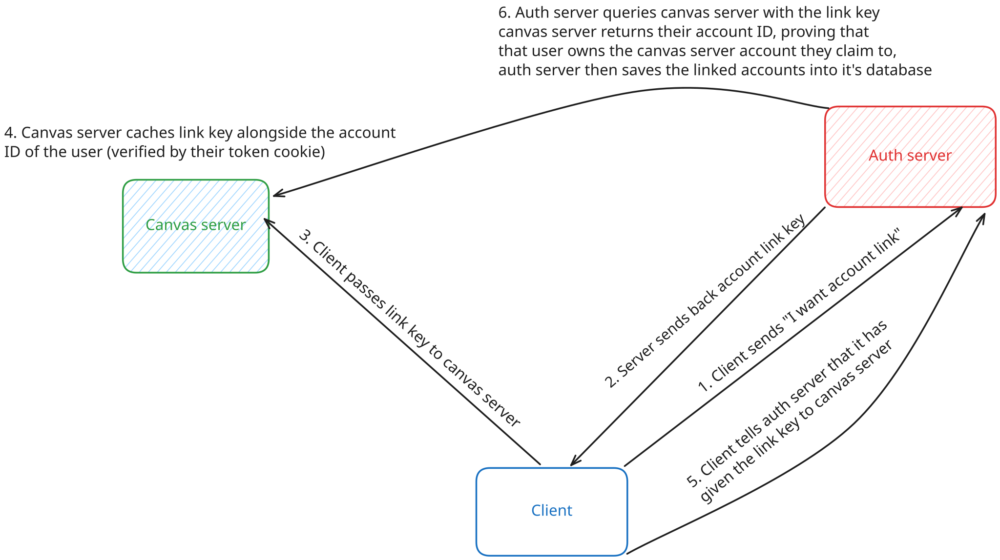
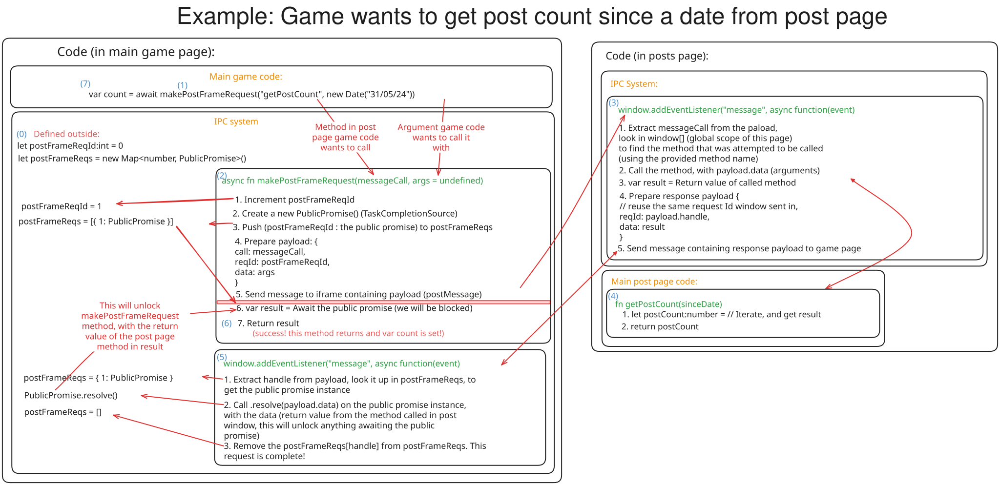
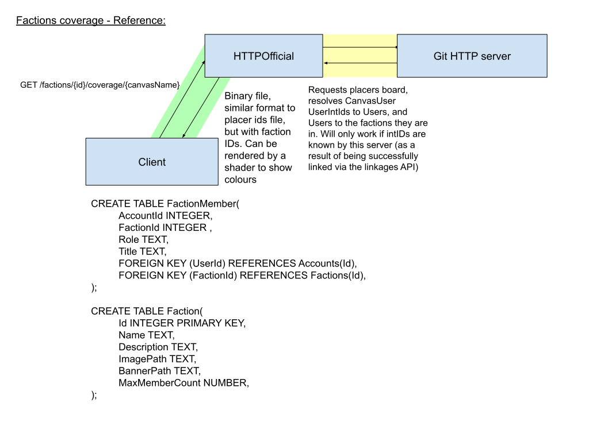
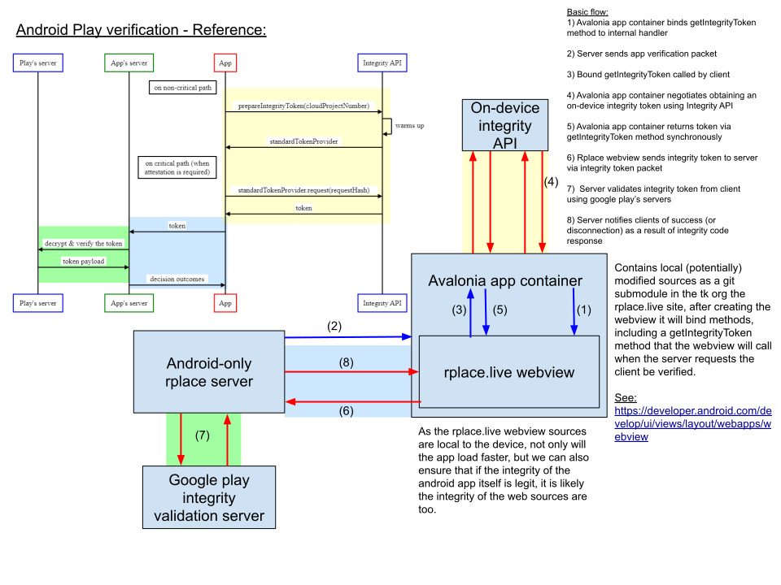

# Architecture
Concepts and technical design documents for systems used in rplace.live

### Account linkage:

### Game page - Posts page iframe IPC:

https://www.npmjs.com/package/shared-ipc
https://github.com/Zekiah-A/shared-ipc

### Factions coverage (WIP):

### Google play verification (WIP):

Thanks to [excalidraw](https://excalidraw.com/) for their amazing diagram designer
Thanks to [drawio](https://diagrams.net/) for their amazing diagram designer
